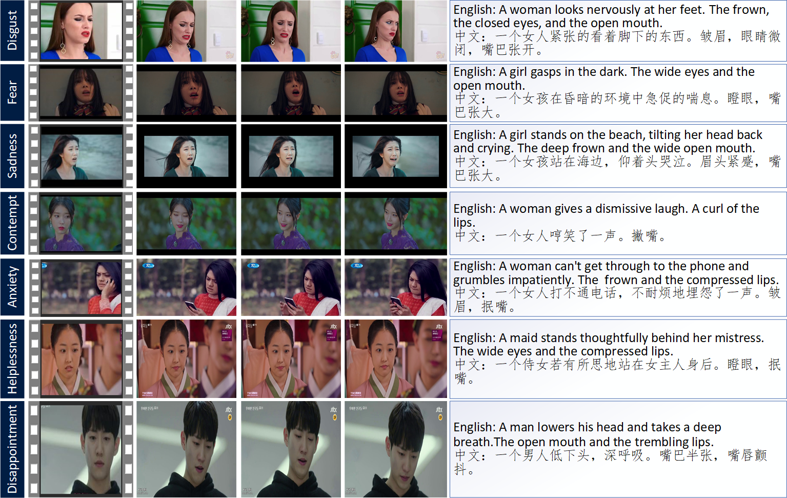
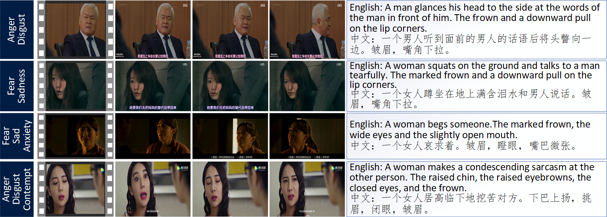

# MAFW

## Details

<b>MAFW</b> is a large-scale, multi-modal, compound affective database for dynamic facial expression recognition in the wild. Clips in this database come from China, Japan, Korea, Europe, America and India, and cover various themes, e.g., variety, family, science fiction, suspense, love, comedy, and interviews, encompassing a wide range of human emotions. Each clip has been independently labeled 11 times by 11 well-trained annotators. MAFW database has enormous diversities, large quantities, and rich annotations, including:

- <b>10,045</b> number of video clips from movies, TV dramas, and short videos
- a <b>11-dimensional</b>  expression distribution vector for each video clip
- <b>three kinds of annotations</b><br /> (1) single expression label<br /> (2) multiple expression label<br /> (3) bilingual emotional descriptive text
-  <b>two subsets</b>: single-expression set, including <b>11</b> classes of <b>single</b>  emotions; multiple-expression set, including  <b>32</b> classes of  <b>multiple </b>emotions
-  <b>three automatic annotations</b>: the frame-level 68 facial landmarks, bounding boxes of face regions, and gender
- <b>four benchmarks</b> : uni-modal single expression classification, uni-modal  compound expression classification, multi-modal single expression classification, and multi-modal compound expression classification.


## Samples Videos


### 1 Examples of the single expressions in MAFW



### 2 Examples of the multiple expressions in MAFW



## Terms & Conditions

- MAFW database is available for  <b>non-commercial research purposes </b> only.
- You agree  <b>not to </b> reproduce, duplicate, copy, sell, trade, resell or exploit for commercial purposes, any portion of the clips, and any derived data.
- You agree  <b>not to </b> further copy, publish, or distribute any portion of the MAFW database. Except for internal use at a single site within the same organization, it is allowed to make copies of the dataset.


##  How to get the MAFW Dataset

This database is publicly available. It is free for professors and researcher scientists affiliated to a University.

Permission to use but not reproduce or distribute the MAFW database is granted to all researchers given that the following steps are properly followed:
1. Download the [MAFW-academics -final.pdf](/academics/mafw-academics-final.pdf) document.
2. Read the terms and conditions carefully to make sure they are acceptable, and fill in the relevant information at the end of the document.
3. Send the completed document to email (ygh2@cug.edu.cn).

## Citation

- [MAFW: A Large-scale, Multi-modal, Compound Affective Database for Dynamic Facial Expression Recognition in the Wild]() ,in ACM Multimedia, 2022.

Please cite our paper if you find our work useful for your research:

```
@inproceedings{xxxxxx,

  title={MAFW: A Large-scale, Multi-modal, Compound Affective Database for Dynamic Facial Expression Recognition in the Wild},

  author={xxxxxx},

  booktitle={xxxxxx},

  pages={xx--xx},

  year={xxxx},

}
```
##  Code

MAFW Code Link ([https://github.com/MAFW-database/MAFW](https://github.com/MAFW-database/MAFW)).

## Contact 

If you have any questions about the dataset, please contact us by email.
<br>
Yuanyuan Liu (Associate Professor, China University of Geosciences)([liuyy@cug.edu.cn]())
<br>
Guanghao Yin (Master, China University of Geosciences) ([ygh2@cug.edu.cn]())
<br>
Also, visit our team research home page at [https://cvlab-liuyuanyuan.github.io/](https://cvlab-liuyuanyuan.github.io/)


